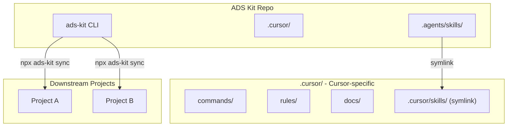

# Agentic Dev Starter Kit (ADS Kit) Implementation

## Architecture




## Phase 1: Repo Restructure

### 1.1 Establish `.agents/` as canonical source

- Delete duplicate content from `.cursor/skills/ai-elements/`
- Keep `.agents/skills/ai-elements/` as the single source of truth

### 1.2 Create symlink for Cursor compatibility

- Create symlink: `.cursor/skills/` → `../.agents/skills/`
- This ensures Cursor's skill discovery still works

### 1.3 Content organization


| Path                | Purpose                             | Portable? |
| ------------------- | ----------------------------------- | --------- |
| `.agents/skills/`   | Reusable skills (ai-elements, etc.) | Yes       |
| `.cursor/commands/` | Cursor slash commands               | No        |
| `.cursor/rules/`    | Cursor MDC rules                    | No        |
| `.cursor/docs/`     | Workflow documentation              | Partially |


## Phase 2: CLI Tool (`ads-kit`)

### 2.1 Package setup

- Create `packages/cli/` directory
- Initialize with TypeScript, minimal dependencies
- Key dependencies: `commander`, `fs-extra`, `chalk`, `ora`

### 2.2 CLI commands

```bash
npx ads-kit init              # Initial setup in a project
npx ads-kit sync              # Pull latest from remote
npx ads-kit add <skill>       # Add specific skill
npx ads-kit list              # Show available skills
```

### 2.3 Core logic

- `init`: Clone/copy `.agents/` and optionally `.cursor/` to target project
- `sync`: Fetch latest from GitHub, merge with local (respecting `.adsignore`)
- `add`: Fetch specific skill folder only

### 2.4 Config file (`.adsrc.json`)

```json
{
  "source": "github:rhyanvargas/ads-kit",
  "include": [".agents/skills", ".cursor/commands"],
  "ignore": ["**/local-*"]
}
```

## Phase 3: Update README and Branding

### 3.1 Rename/rebrand

- Update [README.md](README.md) to "Agentic Dev Starter Kit (ADS Kit)"
- Explain multi-platform scope (Cursor, Windsurf, Claude Code, etc.)
- Document the CLI usage

### 3.2 Update quick start

```bash
# New quick start
npx ads-kit init

# Or manual
git clone --depth 1 https://github.com/rhyanvargas/ads-kit.git /tmp/ads
cp -rn /tmp/ads/.agents ./
cp -rn /tmp/ads/.cursor ./  # if using Cursor
```

## File Changes Summary


| Action | Path                                             |
| ------ | ------------------------------------------------ |
| Delete | `.cursor/skills/ai-elements/` (entire folder)    |
| Create | `.cursor/skills` → `../.agents/skills` (symlink) |
| Create | `packages/cli/` (new CLI package)                |
| Update | `README.md` (rebrand)                            |
| Create | `.adsrc.json` (config schema)                    |


