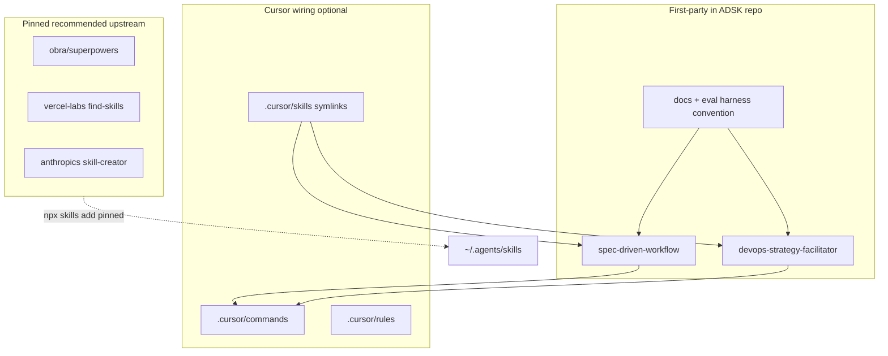

# ADSK Hybrid Overhaul Plan

## Decisions locked

| Decision     | Choice                                                                  | Evidence                                                                                                                        |
| ------------ | ----------------------------------------------------------------------- | ------------------------------------------------------------------------------------------------------------------------------- |
| Packaging    | **Hybrid** — own small first-party set; pin recommended upstream skills | Goals 1, 4, 5 (minimal, maintainable, non-disruptive updates)                                                                   |
| Product name | **The Agentic Development Starter Kit (ADSK)**                          | Spelling fix (“Starter”, not “Start”)                                                                                           |
| GitHub slug  | `agentic-development-starter-kit`                                       | Matches product name                                                                                                            |
| License      | **Apache-2.0**                                                          | Same as [anthropics/skills](https://github.com/anthropics/skills) (ecosystem reference); patent grant suits enterprise adopters |

---

## 1) agentskills.io standards to bake into ADSK

Source: [home](https://agentskills.io/home), [quickstart](https://agentskills.io/skill-creation/quickstart), [best-practices](https://agentskills.io/skill-creation/best-practices), [evaluating-skills](https://agentskills.io/skill-creation/evaluating-skills), [optimizing-descriptions](https://agentskills.io/skill-creation/optimizing-descriptions), [specification](https://agentskills.io/specification).

**Skill authoring (first-party must follow):**

- Progressive disclosure: catalog (`name`+`description`) → `SKILL.md` body → `references/` / `scripts/` on demand
- Keep `SKILL.md` lean (&lt;500 lines / ~5k tokens); load refs only when instructed
- Descriptions: what + when; trigger keywords; under 1024 chars; no “when to use” duplication in body
- Validate with `skills-ref validate ./skill`
- Prefer domain-specific procedures over generic LLM advice; refine via real execution traces

**Eval-driven iteration (goal 6) — adopt as repo convention:**

- Per skill: `evals/evals.json` (prompt, expected_output, optional files, assertions)
- Workspace pattern: `with_skill/` vs `without_skill/` (or prior version), `grading.json`, `timing.json`, `benchmark.json`
- Start with 2–3 cases; add edge case; grade with concrete evidence; blind A/B when comparing versions
- Trigger evals (~20 queries, 50/50 should/shouldn’t) for description accuracy
- Document a human-readable scorecard in `docs/evals/SCORECARD.md` so users can decide which skills to keep

**Deliverable docs:**

- [`docs/skill-authoring.md`](docs/skill-authoring.md) — condensed best practices + links to agentskills.io
- [`docs/evaluating-skills.md`](docs/evaluating-skills.md) — how to run/grade ADSK evals
- Per first-party skill: `evals/evals.json` + seed fixtures where useful

---

## 2) Score current in-repo skills against goals

Scoring: 1–5 per goal axis (higher = better). Axes: Minimal/clear, Expandable SDD kit, Portable, Maintainable, Non-disruptive updates, Evaluable, OSS-ready, Lifecycle coverage.

### `spec-driven-workflow` — overall **3.4 / 5**

| Axis                   | Score | Notes                                                                                                                                                                         |
| ---------------------- | ----- | ----------------------------------------------------------------------------------------------------------------------------------------------------------------------------- |
| Minimal/clear          | 3     | Lean `SKILL.md` index is good; empty [`brownfield-workflow.md`](skills/spec-driven-workflow/references/brownfield-workflow.md); Cursor commands still duplicate skill content |
| Expandable kit         | 4     | Strong SDD spine + commands                                                                                                                                                   |
| Portable               | 4     | Valid `SKILL.md`; Cursor-command coupling in body weakens non-Cursor use                                                                                                      |
| Maintainable           | 3     | Mid-migration to `skills/` + symlinks; duplication with commands                                                                                                              |
| Non-disruptive updates | 2     | No semver/CHANGELOG/pin story                                                                                                                                                 |
| Evaluable              | 1     | No `evals/`                                                                                                                                                                   |
| OSS-ready              | 2     | No LICENSE/CONTRIBUTING yet                                                                                                                                                   |
| Lifecycle              | 3     | Spec→plan→impl→review only                                                                                                                                                    |

**Disposition:** **Keep and harden** as ADSK’s core first-party skill. Fix brownfield ref; thin commands to invoke skill; add evals; de-Cursor-ize portable body (commands as optional Cursor layer).

### `devops-strategy-facilitator` — overall **2.8 / 5**

| Axis                   | Score | Notes                                                                                                   |
| ---------------------- | ----- | ------------------------------------------------------------------------------------------------------- |
| Minimal/clear          | 4     | Short, decision-first — good                                                                            |
| Expandable kit         | 3     | Deploy/strategy only                                                                                    |
| Portable               | 3     | Body points at Cursor command template; no `references/`                                                |
| Maintainable           | 2     | Depth lives in command, not skill (violates [cursor-artifacts](.cursor/rules/cursor-artifacts/RULE.md)) |
| Non-disruptive updates | 2     | Same as above                                                                                           |
| Evaluable              | 1     | No evals                                                                                                |
| OSS-ready              | 2     | Same                                                                                                    |
| Lifecycle              | 2     | Strategy session ≠ implement/monitor                                                                    |

**Disposition:** **Keep and complete** — move template into `skills/.../references/`, thin command, add 2–3 evals.

---

## 3) High-adoption upstream candidates (evaluate, do not vendor)

Security bar for recommendations: prefer official orgs (`anthropics`, `vercel-labs`, `obra` with large public audit), ≥1k installs or strong star signal, Apache/MIT license, no opaque scripts that exfiltrate. skills.sh is uncurated — ADSK must **pin + document trust criteria**, not “install trending.”

| Upstream                                                                                                                                                    | Why it scores well                                | Lifecycle fit                             | ADSK action                                                                                         |
| ----------------------------------------------------------------------------------------------------------------------------------------------------------- | ------------------------------------------------- | ----------------------------------------- | --------------------------------------------------------------------------------------------------- |
| [obra/superpowers](https://github.com/obra/superpowers) (~250k★) — `writing-plans`, `test-driven-development`, `systematic-debugging`, review/branch skills | Encodes plan→TDD→debug posture; composable skills | Plan, develop, test, debug, review        | **Recommend (pinned)** as engineering discipline pack                                               |
| [vercel-labs/skills](https://github.com/vercel-labs/skills) `find-skills` (~2M installs)                                                                    | Ecosystem discovery; update via CLI               | Expandability / maintainability for users | **Recommend (pinned)**; document `skills check` / `skills update`                                   |
| [anthropics/skills](https://github.com/anthropics/skills) `skill-creator` + selective docs skills                                                           | Official eval automation + Apache-2.0             | Skill authoring / evals                   | **Recommend** for maintainers; link eval workflow                                                   |
| `anthropics/skills` `frontend-design` (high installs)                                                                                                       | High adoption UI craft                            | Design (UI)                               | **Optional recommend** — not core enterprise backend                                                |
| User hub: `inspired-product` (wondelai, MIT)                                                                                                                | Discovery/prioritization                          | Ideate / prioritize                       | **Optional recommend** if license/provenance verified in-repo docs                                  |
| User hub: `to-spec`, `spec-driven-development`                                                                                                              | Overlap with ADSK SDD                             | Spec                                      | **Do not add** — collides with first-party `spec-driven-workflow`; document differentiation instead |

**Do not recommend unvetted skills.sh long-tail** without the trust checklist (source org, license, stars/installs, no suspicious scripts).

---

## 4) Replace / update skill set (target architecture)

### First-party (in `skills/`)

1. **`spec-driven-workflow`** — kit spine; fix gaps; add evals; portable language
2. **`devops-strategy-facilitator`** — move depth from command → skill refs; add evals
3. **No new mega-skill** that reimplements Superpowers — avoid duplication and update drag

### Recommended manifest (new)

- Add [`recommended-skills.json`](recommended-skills.json) (or `docs/recommended-skills.md` + machine-readable JSON):
  - `source`, `skill` names, `license`, `trust_notes`, `lifecycle_role`, `install` command, optional **pin** (git tag/commit or skills CLI version when available)
- Add [`docs/lifecycle-coverage.md`](docs/lifecycle-coverage.md) mapping stages → first-party vs recommended:

| Stage              | Coverage                                                                                                       |
| ------------------ | -------------------------------------------------------------------------------------------------------------- |
| Ideate / discover  | Optional `inspired-product` / Superpowers brainstorming                                                        |
| Plan / organize    | First-party SDD + Superpowers `writing-plans`                                                                  |
| Design             | Optional `frontend-design`; SDD for system design in specs                                                     |
| Develop            | SDD implement + Superpowers TDD                                                                                |
| Test               | Superpowers TDD + existing testing rule for consumer projects                                                  |
| Deploy             | First-party DevOps strategy                                                                                    |
| Secure             | Gap for v1 → document as “recommended search via find-skills” + future first-party `security-review` candidate |
| Maintain / monitor | Gap for v1 → documented; DevOps observability questions only                                                   |
| Debug              | Superpowers `systematic-debugging`                                                                             |

### Cursor layer cleanup

- Thin [`.cursor/commands/*`](.cursor/commands/) to invoke/reference skills (per existing artifact rule)
- Keep rules as quality gates only ([testing](.cursor/rules/testing/RULE.md), [project-cmds](.cursor/rules/project-cmds/RULE.md))
- Preserve symlink model: `.cursor/skills/<name>` → `../../skills/<name>`

### Explicit non-goals for this pass

- Vendoring Superpowers/Anthropic skill trees into git
- Building a full monitoring/SRE skill in v1
- Auto-publishing to skills.sh (document how later)

---

## 5) OSS + rename + update UX (goals 4–5, 7)

### Rebrand

- Root [`README.md`](README.md), [`AGENTS.md`](AGENTS.md), [`.cursor/README.md`](.cursor/README.md), skill getting-started refs → **The Agentic Development Starter Kit (ADSK)**
- Replace placeholders (`rhyan-cursor-docs`, `your-org/cursor-spec-driven-starter`) with `owner/agentic-development-starter-kit`
- **GitHub rename** (manual step for you): Settings → Rename repository → `agentic-development-starter-kit`; update remote URL locally

### Open-source baseline (Apache-2.0 industry pattern)

- `LICENSE` (Apache-2.0)
- `NOTICE` if required by Apache practice for attributions
- `CONTRIBUTING.md`, `CODE_OF_CONDUCT.md` (Contributor Covenant), `SECURITY.md`
- `CHANGELOG.md` + semver tags (`v0.1.0` first public)
- `.gitignore`, GitHub issue/PR templates under `.github/`
- Badges: license, agentskills.io, skills.sh (when published)

### Non-disruptive updates for users

Document three install modes and update paths:

1. **Project copy** — `skills/` + optional `.cursor/` in consumer repo; ADSK upgrades via git remote/subtree or re-copy with migration notes in CHANGELOG
2. **Global hub** — `npx skills add <owner>/agentic-development-starter-kit -g` + `npx skills update`; project workflow (local `.cursor/`, specs, plans) untouched
3. **Recommended upstream** — pinned in `recommended-skills.json`; `npx skills update` after reviewing ADSK release notes

Add `docs/upgrading.md`: never overwrite consumer specs/plans; prefer additive skill changes; breaking skill renames only in major versions.

---

## 6) Eval program so users can decide (goal 6)

For each first-party skill:

1. Author `evals/evals.json` (2–3 starter cases + 1 edge)
2. Run with/without skill; grade assertions; record `benchmark` summary
3. Publish human scorecard rows in `docs/evals/SCORECARD.md` (pass_rate delta, token cost, qualitative notes, recommendation: keep / optional / replace)

For recommended upstream:

- Do **not** claim we ran their full suite; publish **trust + fit scorecard** (adoption, license, lifecycle role, known coupling risks e.g. Superpowers paths under `docs/superpowers/`)
- Optional: 1 smoke prompt per recommended skill documented as “smoke check” for adopters

Also add trigger-eval query sets under `evals/trigger/` for first-party descriptions.

---

## 7) Implementation sequence

1. **OSS + branding foundation** — LICENSE Apache-2.0, community files, rename docs to ADSK, `.gitignore`
2. **Finish skills migration** — commit root `skills/` + `.cursor/skills` symlinks; drop duplicated trees
3. **Harden first-party skills** — brownfield content, DevOps refs, thin commands, description polish
4. **Eval harness + scorecards** — evals for both first-party skills; authoring/eval docs linked to agentskills.io
5. **Recommended skills manifest + lifecycle map** — pin Superpowers, find-skills, skill-creator; document gaps (secure/monitor)
6. **Upgrade/install docs** — three modes; `npx skills` update story
7. **GitHub rename + first release** — you rename remote; tag `v0.1.0`; optional skills.sh listing

---

## Key files to change

- [`README.md`](README.md), [`AGENTS.md`](AGENTS.md), [`.cursor/README.md`](.cursor/README.md)
- [`skills/spec-driven-workflow/**`](skills/spec-driven-workflow/), [`skills/devops-strategy-facilitator/**`](skills/devops-strategy-facilitator/)
- [`.cursor/commands/*.md`](.cursor/commands/), [`.cursor/rules/**`](.cursor/rules/)
- New: `LICENSE`, `CONTRIBUTING.md`, `SECURITY.md`, `CODE_OF_CONDUCT.md`, `CHANGELOG.md`, `recommended-skills.json`, `docs/*`, `skills/*/evals/`
