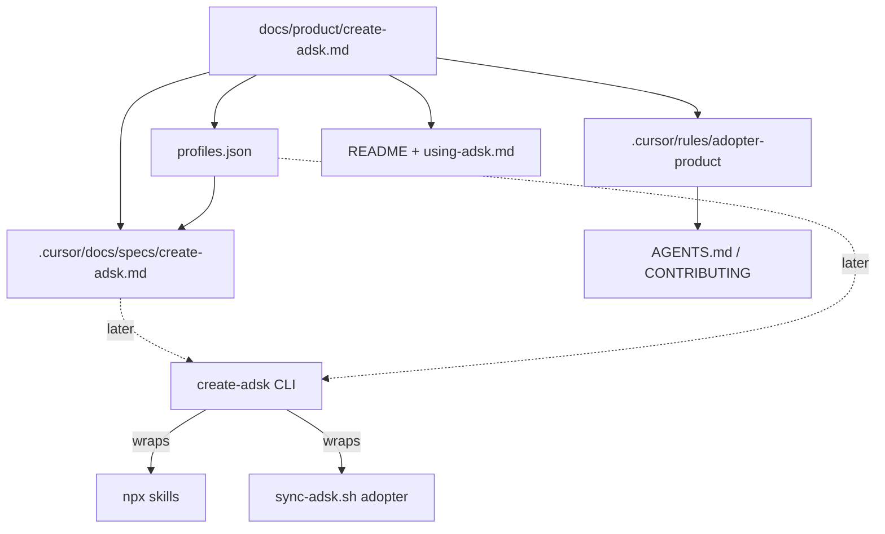

# Bake create-adsk product direction

## Scope (locked)

**In:** direction docs, `profiles.json`, Cursor rule, pointer updates, living spec.  
**Out:** `packages/create-adsk` / npm publish / CLI implementation (next phase, driven by the spec).

## Architecture (what gets enforced)

## 1. Product contract

Add [`docs/product/create-adsk.md`](docs/product/create-adsk.md) as the single source of truth. Content from the approved PO brief:

- **Job / one-liner:** repo adopter for ADSK (workflow + Cursor wiring + versioned profile), not a skills marketplace
- **Two-tool model:** `npx skills` = skill transport; `npx create-adsk` = kit adoption (mark CLI as **planned** until shipped)
- **Profiles:** Core / Delivery / Maintainer / Skills-only
- **Hard rules:** shell out to skills CLI; no third-party catalog UI; Cursor default on for Core/Delivery/Maintainer; Skills-only skips `.cursor/`; persist `.adsk/config.json`; optional product-value-loop is a separate yes/no (from [`recommended-skills.json`](recommended-skills.json)), not a skill picker
- **Kill criteria + success metrics** from the brief
- **Non-goals:** kit `sync-adsk.sh kit` mode; competing with skills.sh discovery

## 2. Machine-readable profiles

Add root [`profiles.json`](profiles.json) (peer of `recommended-skills.json`) as the enforceable skill/Cursor matrix:

| Profile       | Skills                                                      | Cursor     | Rules   |
| ------------- | ----------------------------------------------------------- | ---------- | ------- |
| `core`        | `spec-driven-workflow`                                      | `commands` | `none`  |
| `delivery`    | core + `devops-strategy-facilitator` + `release-automation` | `commands` | `none`  |
| `maintainer`  | delivery + `skill-optimizer` + `readme-authoring`           | `commands` | `stock` |
| `skills-only` | all five first-party                                        | `none`     | `none`  |

Include: schema version, short descriptions, `optional_packs` pointer to product-value-loop ids in `recommended-skills.json`, and a `do_not` note forbidding skill-marketplace UX. Future CLI must read this file; docs must not invent a different skill list.

## 3. Cursor rule (agent enforcement)

Add [`.cursor/rules/adopter-product/RULE.md`](.cursor/rules/adopter-product/RULE.md) with `alwaysApply: true`:

- Adopter install/UX changes must align with `docs/product/create-adsk.md` + `profiles.json`
- Forbidden: interactive third-party skill catalogs; reinventing `npx skills` install; presenting create-adsk as “skills.sh with a menu”
- Required: when changing adopter path, update product doc, `profiles.json`, and the create-adsk spec together
- Clarify: `sync-adsk.sh kit` = maintainer-only; adopter north star = create-adsk (planned); interim path remains `adopter --from` + skills CLI per [`docs/using-adsk.md`](docs/using-adsk.md)

## 4. Pointer updates (make the contract discoverable)

Light edits only:

- [`AGENTS.md`](AGENTS.md) — “Product direction” blurb linking `docs/product/create-adsk.md` + `profiles.json`; note planned create-adsk vs interim sync
- [`CONTRIBUTING.md`](CONTRIBUTING.md) — principle: adopter product = profile adoption, not skill menus
- [`README.md`](README.md) — short “Direction” note + link in Docs table; keep current install commands as working path
- [`docs/using-adsk.md`](docs/using-adsk.md) — top callout: skills = folders; create-adsk (planned) = kit+Cursor profile; interim = clone + `sync-adsk.sh adopter`
- [`docs/RELEASE.md`](docs/RELEASE.md) — checklist item: profiles ↔ product doc ↔ using-adsk stay consistent
- [`.cursor/rules/cursor-artifacts/RULE.md`](.cursor/rules/cursor-artifacts/RULE.md) — one row for product contract / `profiles.json` so artifact map stays complete
- [`.cursor/rules/project/RULE.md`](.cursor/rules/project/RULE.md) — one line pointing at adopter-product rule / product doc

No rewrite of the full adopter guide; positioning only.

## 5. Living SDD spec

Add [`.cursor/docs/specs/create-adsk.md`](.cursor/docs/specs/create-adsk.md) using the standard template from [`skills/spec-driven-workflow/references/spec-writing-guide.md`](skills/spec-driven-workflow/references/spec-writing-guide.md):

- Overview, assumptions, functional REQs (init/update/status; profile-only UX; wrap skills CLI; wrap `sync-adsk.sh adopter`; write `.adsk/config.json`; dry-run; `--yes`)
- Non-goals / Never boundaries (no skill marketplace; no kit symlink mode)
- Acceptance criteria + test strategy (CLI behavior later; for this slice, “spec exists and maps 1:1 to profiles.json”)
- Constraints: reuse existing adopter flags (`--commands-only`, `--skip-skills`, `--rules`, `--force-rules`, etc.)

This unlocks `/plan-impl` when ready to build—not in this slice.

## Done criteria for this slice

- Product contract and `profiles.json` agree on the four profiles
- Rule is always-on and forbids marketplace drift
- README / AGENTS / CONTRIBUTING / using-adsk point at the contract
- Spec is ready for a later implementation plan
- No npm package or CLI code landed

## Explicitly deferred

- Implementing `npx create-adsk`
- Changing `sync-adsk.sh` behavior beyond docs referencing it
- Syncing adopter apps (no kit skill tree change → no `./scripts/sync-adsk.sh kit` required unless a new rule folder needs discovery elsewhere; rule is kit-local only)
