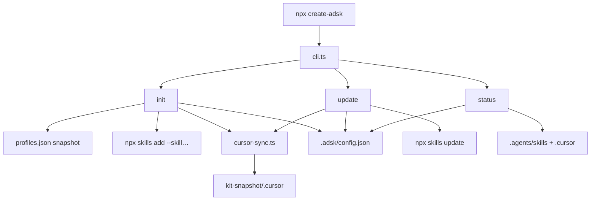

# create-adsk CLI — Implementation Plan

> **For agentic workers:** Implement task-by-task. Prefer TDD inside `packages/create-adsk`. Do not start until the user approves this plan (medium+). After approval: `/implement-spec .cursor/plans/create-adsk.plan.md`.

**Goal:** Ship `npx create-adsk` so adopters apply a versioned ADSK **profile** (skills + optional Cursor wiring + `.adsk/config.json`) without a manual kit clone or a skills marketplace UX.

**Architecture:** New npm package at `packages/create-adsk` shells out to `npx skills` for skill bytes and ports adopter Cursor sync (same behavior as `scripts/sync-adsk.sh adopter`) against a **vendored kit snapshot** baked at pack time. Profile matrix is always read from snapshotted `profiles.json`. Kit-maintainer `kit` mode is never exposed.

**Tech stack:** Node 20+ (engines), TypeScript, `commander`, `@clack/prompts`, Vitest, `execa` (or `node:child_process`).

**Size:** Medium → Large (multi-file CLI + publish wiring). Full SDD plan → implement → review.

**Spec:** [`.cursor/docs/specs/create-adsk.md`](../docs/specs/create-adsk.md)  
**Contract:** [`docs/product/create-adsk.md`](../../docs/product/create-adsk.md) · [`profiles.json`](../../profiles.json)

---

## Locked decisions (resolve spec “Open for implementation plan”)

| Open question | Decision | Evidence |
|---------------|----------|----------|
| npm layout | **`packages/create-adsk`** published as package name `create-adsk` (`bin`: `create-adsk`) | Bake plan foreshadowed this path; root stays skills/docs source for `npx skills add`, not an npm app root |
| Cursor artifacts | **Vendor kit snapshot at pack/publish**; runtime sync reads package-local snapshot; `kitRef` records snapshot identity (e.g. `rhyanvargas/agentic-development-starter-kit@<gitSha>`) | REQ-008 forbids requiring a manual kit clone; vendoring = deterministic `npx` UX + works offline for Cursor files; skills still fetched via skills CLI |
| skills CLI flags | **`npx --yes skills add <kit_source> --skill <n>… -y`** (+ `-g` when scope=global); update: **`npx --yes skills update -y`** (+ `-p`/`-g` when available) | Verified against current skills CLI help (2026-07-18): `-s/--skill`, `-y/--yes`, `-g/--global`; update has `-y`, `-p`, `-g` |

**Optional later (out of v1):** `--from PATH|URL` override to live-clone like `sync-adsk.sh` for bleeding-edge Cursor files. Not required for REQ-008.

---

## Global constraints

- Always wrap `npx skills` for skill install/update — never reimplement skill fetch.
- Always read profile skill lists from `profiles.json` (snapshotted) — never invent lists.
- Never expose `sync-adsk.sh kit` or any third-party/registry skill browser (REQ-012, REQ-013).
- Stock rules only: `skill-authoring`, `testing`, `project-cmds` (match `STOCK_RULES` in `scripts/sync-adsk.sh`).
- Never overwrite existing rules unless `--force-rules`.
- Never write `.cursor/commands` or `.cursor/rules` when profile `cursor` is `none` (skills-only).
- Do not overwrite adopter `.cursor/docs/specs` or `.cursor/plans` content (mkdir empty homes only, same as sync script).
- Docs/CLI help must state two-tool model (REQ-014).
- Ask first before changing profile membership or renaming the npm package.

---

## Target file map

```text
packages/create-adsk/
  package.json                 # name: create-adsk, bin: create-adsk
  tsconfig.json
  vitest.config.ts
  README.md                    # two-tool model + usage
  src/
    cli.ts                     # commander entry: init (default), update, status
    index.ts                   # re-exports if needed
    types.ts                   # AdskConfig, ProfileId, ProfilesFile
    profiles.ts                # loadProfiles(), resolveProfile(), optional packs
    config.ts                  # read/write .adsk/config.json
    skills.ts                  # buildSkillsAddArgs(), runSkillsAdd/Update (injectable runner)
    cursor-sync.ts             # syncCommands(), syncRules() — port of sync-adsk.sh adopter bits
    path-rewrite.ts            # translate_command_body equivalent
    init.ts                    # interactive + non-interactive init orchestration
    update.ts
    status.ts
    help-copy.ts               # shared two-tool strings for --help
    snapshot.ts                # resolve path to vendored kit-snapshot/
  kit-snapshot/                # generated — do not hand-edit; gitignore or generate in CI
    profiles.json
    recommended-skills.json
    .cursor/commands/*.md
    .cursor/rules/{skill-authoring,testing,project-cmds}/
    KIT_REF                    # single-line git sha or tag recorded at snapshot
  test/
    helpers/temp-app.ts
    profiles.test.ts
    config.test.ts
    skills-args.test.ts
    cursor-sync.test.ts
    init.integration.test.ts
    update.integration.test.ts
    status.integration.test.ts
    help.test.ts
scripts/
  prepare-create-adsk-snapshot.sh   # copy kit artifacts → packages/create-adsk/kit-snapshot
```

Root changes (T9): optional workspace `package.json` (private) listing `packages/create-adsk`, update `.cursor/rules/project-cmds`, `docs/using-adsk.md`, product/spec status, README.

---

## Requirements → tasks

| Requirement | Tasks |
|-------------|-------|
| REQ-001 Interactive / profile select | T2, T5 |
| REQ-002 Optional packs prompt (default No) | T2, T5 |
| REQ-003 skills add with `--skill` | T3, T5, T10 |
| REQ-004 Cursor commands sync + path rewrite | T4, T5, T10 |
| REQ-005 Stock rules add-if-missing / `--force-rules` | T4, T5, T10 |
| REQ-006 skills-only: no Cursor writes | T4, T5, T10 |
| REQ-007 `.adsk/config.json` | T2, T5, T10 |
| REQ-008 `update` | T6, T10 |
| REQ-009 `status` + drift | T7, T10 |
| REQ-010 `--yes`, `--dry-run`, `--scope` | T3, T5, T10 |
| REQ-011 `--profile <id>` | T5, T10 |
| REQ-012 No skill browser | T1, T5, T8 |
| REQ-013 No kit mode | T1, T8 |
| REQ-014 Two-tool help/docs | T8, T9 |

---

## Architecture flow



---

## Tasks

### T1 — Scaffold `packages/create-adsk`

**Maps to:** REQ-012, REQ-013 (structure that cannot expose kit mode / marketplace)  
**Files:**
- Create: `packages/create-adsk/package.json`
- Create: `packages/create-adsk/tsconfig.json`
- Create: `packages/create-adsk/vitest.config.ts`
- Create: `packages/create-adsk/src/cli.ts` (stub)
- Create: `packages/create-adsk/src/help-copy.ts`

**Steps:**
- [ ] **T1.1** Create package with `"type": "module"`, `"bin": { "create-adsk": "./dist/cli.js" }`, engines `node >= 20`, deps: `commander`, `@clack/prompts`; devDeps: `typescript`, `vitest`, `@types/node`.
- [ ] **T1.2** Stub CLI with subcommands `init` (default), `update`, `status` — **no** `kit`, **no** `find`/`browse`/`search` skills commands.
- [ ] **T1.3** `help-copy.ts` exports `TWO_TOOL_BLURB` constant (used later in `--help` and README).
- [ ] **T1.4** Verify: `cd packages/create-adsk && npm install && npx tsc --noEmit` succeeds on stub.

**Done when:** Package builds; `node dist/cli.js --help` lists only adopter commands.

---

### T2 — Profiles + config

**Maps to:** REQ-001, REQ-007  
**Files:**
- Create: `packages/create-adsk/src/types.ts`
- Create: `packages/create-adsk/src/profiles.ts`
- Create: `packages/create-adsk/src/config.ts`
- Create: `packages/create-adsk/src/snapshot.ts`
- Create: `packages/create-adsk/test/profiles.test.ts`
- Create: `packages/create-adsk/test/config.test.ts`
- Create: `scripts/prepare-create-adsk-snapshot.sh` (minimal: copy root `profiles.json` + `recommended-skills.json` + write `KIT_REF`)

**Interfaces:**
```ts
export type ProfileId = "core" | "delivery" | "maintainer" | "skills-only";
export type CursorMode = "commands" | "none";
export type RulesMode = "stock" | "none";
export type Scope = "project" | "global";

export interface AdskConfig {
  version: 1;
  profile: ProfileId;
  cursor: CursorMode;
  rules: RulesMode;
  scope: Scope;
  kitRef: string;
  optionalPacks: string[];
}

export function loadProfiles(snapshotRoot: string): ProfilesFile;
export function getProfile(profiles: ProfilesFile, id: ProfileId): ProfileDef;
export function writeConfig(appRoot: string, cfg: AdskConfig): void;
export function readConfig(appRoot: string): AdskConfig | null;
```

**Steps:**
- [ ] **T2.1** Write failing tests: `getProfile` returns delivery skills `["spec-driven-workflow","devops-strategy-facilitator","release-automation"]`; `skills-only.cursor === "none"`; `writeConfig`/`readConfig` round-trip all `config_marker.fields`.
- [ ] **T2.2** Implement loaders; snapshot path via `import.meta.url` → `kit-snapshot/`.
- [ ] **T2.3** Run snapshot script once so tests have real `profiles.json`.
- [ ] **T2.4** `npx vitest run test/profiles.test.ts test/config.test.ts` — PASS.

**Done when:** Config shape matches `profiles.json` `config_marker.fields`.

---

### T3 — Skills CLI runner

**Maps to:** REQ-003, REQ-010, REQ-011  
**Files:**
- Create: `packages/create-adsk/src/skills.ts`
- Create: `packages/create-adsk/test/skills-args.test.ts`

**Interfaces:**
```ts
export type RunCommand = (argv: string[], opts: { cwd: string; dryRun: boolean }) => Promise<{ code: number; argv: string[] }>;

export function buildSkillsAddArgv(opts: {
  kitSource: string;       // from profiles.kit_source
  skills: string[];
  scope: Scope;
  yes: boolean;
}): string[];
// Example project/yes:
// ["npx","--yes","skills","add","rhyanvargas/agentic-development-starter-kit",
//  "--skill","spec-driven-workflow","--skill","devops-strategy-facilitator",
//  "--skill","release-automation","-y"]

export function buildSkillsUpdateArgv(opts: { scope: Scope; yes: boolean }): string[];
// ["npx","--yes","skills","update","-y","-p"]  // project
// ["npx","--yes","skills","update","-y","-g"]  // global

export function buildOptionalPackArgv(installCmd: string, scope: Scope): string[];
// Parse recommended-skills.json install / install_global strings; ensure -y present when yes.
```

**Steps:**
- [ ] **T3.1** Unit-test argv builders only (no network) — assert `--skill` per profile skill; assert `-g` only for global; assert no catalog/`find` flags.
- [ ] **T3.2** Implement `runSkills` with injectable `RunCommand`; dry-run returns without spawning.
- [ ] **T3.3** Vitest PASS.

**Done when:** Argv matches verified skills CLI contract; injectable for integration fakes.

---

### T4 — Cursor sync port

**Maps to:** REQ-004, REQ-005, REQ-006  
**Files:**
- Create: `packages/create-adsk/src/path-rewrite.ts`
- Create: `packages/create-adsk/src/cursor-sync.ts`
- Create: `packages/create-adsk/test/cursor-sync.test.ts`
- Extend: `scripts/prepare-create-adsk-snapshot.sh` to copy `.cursor/commands/*.md` and stock rule dirs

**Parity with** `scripts/sync-adsk.sh`:
- `translate_command_body`: rewrite `(^|[^/])skills/<name>` → `.agents/skills/<name>`; strip redundant adopter parenthetical.
- Commands: always overwrite/update translated command files when syncing (same as bash).
- Rules: stock set only; skip if dest exists unless `forceRules`.
- `cursor: none` → no mkdir/writes under `.cursor/commands` or `.cursor/rules`.
- May `mkdir` `.cursor/docs/specs` and `.cursor/plans` when cursor sync runs (empty homes) — never copy kit specs/plans content.

**Interfaces:**
```ts
export function rewriteCommandBody(body: string, skillNames: string[]): string;
export function syncCursor(opts: {
  snapshotRoot: string;
  appRoot: string;
  cursor: CursorMode;
  rules: RulesMode;
  forceRules: boolean;
  dryRun: boolean;
}): { commandsWritten: string[]; rulesWritten: string[]; skipped: string[] };
```

**Steps:**
- [ ] **T4.1** Fixture: tiny fake command containing `skills/spec-driven-workflow` → expect `.agents/skills/spec-driven-workflow`.
- [ ] **T4.2** Test skills-only: after sync, `.cursor/commands` absent.
- [ ] **T4.3** Test stock rules: existing rule dir preserved without `--force-rules`.
- [ ] **T4.4** Implement; vitest PASS.
- [ ] **T4.5** Manual parity check (once): run bash `adopter --commands-only --skip-skills` into temp A and TS sync into temp B; diff commands (optional in T10).

**Done when:** Path rewrite + rules semantics match sync script for adopter cases create-adsk uses.

---

### T5 — `init` command

**Maps to:** REQ-001, REQ-002, REQ-003, REQ-004, REQ-005, REQ-006, REQ-007, REQ-010, REQ-011  
**Files:**
- Create: `packages/create-adsk/src/init.ts`
- Modify: `packages/create-adsk/src/cli.ts`
- Create: `packages/create-adsk/test/init.integration.test.ts` (fake skills runner)

**Behavior:**
1. Resolve profile: `--profile` or interactive select from profile ids/descriptions; with `--yes` and no `--profile`, default **`core`** (document in help).
2. Optional packs: if interactive, yes/no (default No per `optional_packs.prompt_default`); if `--yes`, skip packs (No) unless `--optional-packs` flag (add if needed for CI: `--optional-packs` comma-list or omit for v1 and only support interactive packs — **v1 decision:** `--yes` ⇒ no optional packs; interactive only for packs unless `--with-optional-packs` boolean).
3. Run skills add for profile skills (and optional pack install commands when selected).
4. If `cursor === "commands"`, sync commands; if `rules === "stock"`, sync stock rules.
5. Write `.adsk/config.json`.
6. Print next-step hint (`/quick-start` when Cursor synced).

**Flags:** `--profile`, `--yes`/`-y`, `--dry-run`, `--scope project|global`, `--force-rules`, `--target <dir>` (default `.`).

**Steps:**
- [ ] **T5.1** Integration test with mocked `RunCommand`: `init --profile delivery --yes` → skills argv contains three `--skill`s; commands present under temp app; config.profile === `delivery`; no `find` in argv.
- [ ] **T5.2** `init --profile skills-only --yes` → no `.cursor/commands`.
- [ ] **T5.3** Implement orchestration; PASS.

**Done when:** Acceptance criteria #1 and #2 from the spec pass under mocked skills CLI.

---

### T6 — `update` command

**Maps to:** REQ-008  
**Files:**
- Create: `packages/create-adsk/src/update.ts`
- Create: `packages/create-adsk/test/update.integration.test.ts`

**Behavior:**
1. Require `.adsk/config.json` (error with “run create-adsk init” if missing).
2. `skills update` with scope from config.
3. Re-install optional packs if listed (or document: update refreshes first-party via `skills update`; optional packs best-effort `skills update` by name — keep simple: run `skills update -y` for scope; re-sync Cursor from **current package snapshot**).
4. Skip Cursor when `cursor === "none"`.
5. Do not require user-supplied `--from`.

**Steps:**
- [ ] **T6.1** Test: config delivery → update calls skills update argv + rewrites commands; skills-only → no Cursor writes.
- [ ] **T6.2** Implement; PASS.

---

### T7 — `status` command

**Maps to:** REQ-009  
**Files:**
- Create: `packages/create-adsk/src/status.ts`
- Create: `packages/create-adsk/test/status.integration.test.ts`

**Behavior:**
Print:
- profile, kitRef, cursor, rules, scope, optionalPacks
- drift: profile skills missing under `.agents/skills/<name>/SKILL.md` (and global path if scope=global — detect `~/.agents/skills` when scope global)
- optional: command file missing when cursor=commands

Exit code: `0` if no drift; `1` if drift (CI-friendly) — document in help.

**Steps:**
- [ ] **T7.1** Test missing skill → reports drift + exit 1.
- [ ] **T7.2** Implement; PASS.

---

### T8 — Help + package README (two-tool model)

**Maps to:** REQ-012, REQ-014  
**Files:**
- Create: `packages/create-adsk/README.md`
- Modify: `packages/create-adsk/src/cli.ts` / `help-copy.ts`
- Create: `packages/create-adsk/test/help.test.ts`

**Required copy (golden substrings):**
- “Use `npx skills` to install skill folders”
- “Use `npx create-adsk` when you want ADSK’s workflow + Cursor”
- Must **not** contain marketplace-y phrases: “browse skills”, “skill catalog”, “discover skills from GitHub” as a feature of create-adsk

**Steps:**
- [ ] **T8.1** Golden test on `--help` text.
- [ ] **T8.2** README mirrors product one-liner + profiles table (link to kit `profiles.json` / product doc).

---

### T9 — Snapshot script, workspace, docs, project-cmds

**Maps to:** publish readiness; REQ-014 docs  
**Files:**
- Create/finish: `scripts/prepare-create-adsk-snapshot.sh`
- Create: root `package.json` (private workspace) **or** document `cd packages/create-adsk` only — prefer root private package with `"workspaces": ["packages/create-adsk"]` for `npm test` convenience
- Modify: `.cursor/rules/project-cmds/RULE.md` — add create-adsk test/build commands
- Modify: `docs/using-adsk.md`, `docs/product/create-adsk.md`, `.cursor/docs/specs/create-adsk.md` — status → “CLI implemented” when shipping; until publish keep “shipping”
- Modify: `README.md` — point to `npx create-adsk` when package is publishable
- Modify: `.gitignore` — ignore `packages/create-adsk/kit-snapshot/` if generated in CI; **or** commit snapshot for reproducible installs without prepare — **decision: commit generated snapshot in repo** so `npx` from git works; script refreshes it on release

**Snapshot script must copy:**
```bash
profiles.json
recommended-skills.json
.cursor/commands/*.md
.cursor/rules/skill-authoring
.cursor/rules/testing
.cursor/rules/project-cmds
# KIT_REF=$(git rev-parse HEAD)
```

Hook: `"prepack": "npm run snapshot"` in create-adsk package.

**Verify:** `./scripts/sync-adsk.sh self-check` still passes; `cd packages/create-adsk && npm test`.

---

### T10 — Full integration suite + acceptance mapping

**Maps to:** REQ-001–014 acceptance criteria  
**Files:** `packages/create-adsk/test/*.integration.test.ts`

| Acceptance (spec) | Test |
|-------------------|------|
| `create-adsk --profile delivery --yes` → 3 skills args, Cursor commands with `.agents/skills/` paths, config delivery, no catalog | `init.integration.test.ts` |
| skills-only → no `.cursor/commands` created | same |
| existing config → `update` refreshes without `--from` | `update.integration.test.ts` |
| help answers “why not just npx skills?” | `help.test.ts` |

Fake the skills runner in all integration tests (no network). One optional smoke (manual/CI opt-in) may call real `npx skills` behind `ADSK_E2E=1`.

**Done when:** `npm test` green; map each REQ to at least one assertion or explicit NFR review note in test file comments for REQ-012/013.

---

## Risks

| Risk | Mitigation |
|------|------------|
| skills CLI flag drift | Pin documented flags in `skills-args.test.ts`; fail loudly if spawn exits non-zero with stderr hint to upgrade skills CLI |
| Bash vs TS sync drift | Keep stock rule list + rewrite regex shared with comments pointing at `sync-adsk.sh` line anchors; optional diff self-check later |
| Snapshot stale vs kit | `prepare-create-adsk-snapshot.sh` on release; `kitRef` in config exposes mismatch via `status` |
| Windows: bash script unused | TS port is the supported path; sync-adsk.sh remains interim/agent path |

---

## Out of scope (v1)

- Publishing to npm registry (implement package; publish is a release step)
- `--from` live kit override
- Changing `profiles.json` membership
- Kit `sync-adsk.sh kit` behind any CLI command
- Product-value-loop pack multi-select UI (yes/no or `--with-optional-packs` only)

---

## Verify commands (after implementation)

```bash
./scripts/sync-adsk.sh self-check
cd packages/create-adsk && npm test
cd packages/create-adsk && node dist/cli.js --help
# Manual (optional):
cd /tmp/some-app && npx --yes /path/to/packages/create-adsk --profile delivery --yes --dry-run
```

---

## Spec coverage self-check

| REQ | Covered? |
|-----|----------|
| 001–011 | T2–T7, T10 |
| 012–014 | T1, T8, T9 |
| Open questions | Locked in plan header; update living spec in T9 |

No TBD placeholders remain for v1 decisions.
