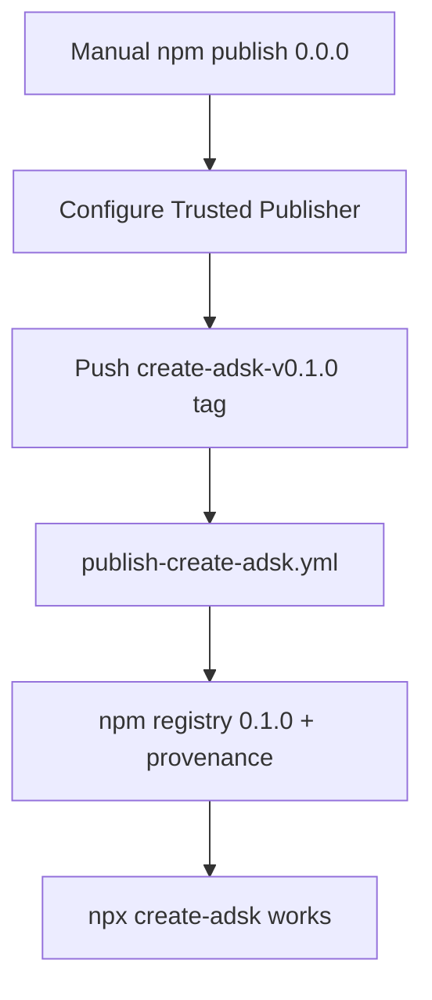

# create-adsk — first npm publish (maintainer bootstrap)

## Scope (this pass)

- **Manual maintainer ops** to ship `create-adsk@0.1.0` to the public npm registry
- **Verify** `npx create-adsk` works for adopters

**Already done (engineering):**

- [`.github/workflows/publish-create-adsk.yml`](../.github/workflows/publish-create-adsk.yml) — OIDC publish on `create-adsk-v*` tags
- `packages/create-adsk` `publishConfig.access` + `provenance`
- Runbook sections in [`docs/RELEASE.md`](../../docs/RELEASE.md) and [`SECURITY.md`](../../SECURITY.md)

**Out of scope:**

- Kit semver tags (`v*` from release-please) — separate from npm package versioning
- Publishing the kit repo itself as an npm package (root is `private: true`)
- Major dependency upgrades (Dependabot #12/#13 — clack 1.x, TS 7 / Vitest 4)

## Preconditions

| Check | Expected |
|-------|----------|
| `main` includes Trusted Publishing workflow | merged via [#14](https://github.com/rhyanvargas/agentic-development-starter-kit/pull/14) |
| `packages/create-adsk/package.json` `version` | `0.1.0` (or chosen first release) |
| npm registry | `create-adsk` **not** published yet (`npm view create-adsk` → 404) |
| npm account | Maintainer with publish rights to unscoped name `create-adsk` |

## Why a manual bootstrap is required

npm Trusted Publishing cannot be configured until the package **exists** on the registry. First publish must use interactive `npm login` (or a one-time token). After that, CI publishes via OIDC — no long-lived `NPM_TOKEN` in GitHub secrets.

Docs: [npm Trusted Publishers](https://docs.npmjs.com/trusted-publishers/)

## 1. Reserve the package name (once)

From a machine with npm credentials (not CI):

```bash
npm login

dir="$(mktemp -d)"
printf '%s\n' '{
  "name": "create-adsk",
  "version": "0.0.0",
  "description": "OIDC bootstrap placeholder — real releases from GitHub Actions",
  "license": "MIT"
}' > "$dir/package.json"

npm publish "$dir" --access public
```

**Done when:** https://www.npmjs.com/package/create-adsk loads (shows `0.0.0`).

## 2. Configure Trusted Publisher (once)

npmjs.com → **create-adsk** → **Settings** → **Trusted Publisher** → **GitHub Actions**:

| Field | Value |
|-------|--------|
| Organization or user | `rhyanvargas` |
| Repository | `agentic-development-starter-kit` |
| Workflow filename | `publish-create-adsk.yml` |
| Environment name | *(empty)* |
| Allowed actions | `npm publish` |

**Done when:** settings saved; workflow filename matches exactly (`.yml`, case-sensitive).

## 3. Optional — pack dry-run in GitHub

GitHub → **Actions** → **publish-create-adsk** → **Run workflow** → `dry_run: true`.

Expect: pack succeeds; **no** registry version bump beyond placeholder.

## 4. Cut first real release

Ensure `main` has the intended version in `packages/create-adsk/package.json`, then:

```bash
git checkout main && git pull origin main

git tag -a create-adsk-v0.1.0 -m "create-adsk v0.1.0"
git push origin create-adsk-v0.1.0
```

Workflow runs: `npm ci` → audit → test → build → tag/version check → `npm publish -w create-adsk`.

**Done when:** Actions job green; npm shows `create-adsk@0.1.0`.

## 5. Verify for adopters

```bash
npm view create-adsk version
npm view create-adsk repository
npx create-adsk@0.1.0 --help
```

Smoke in a clean app repo:

```bash
npx create-adsk@0.1.0 --profile core --yes --dry-run
```

Update adopter docs only if install UX changed (default path becomes `npx create-adsk` without local checkout).

## 6. Harden (after green OIDC publish)

On npmjs.com → package **Settings → Publishing access**:

- Prefer **Require two-factor authentication and disallow tokens** so only Trusted Publishing can publish.

See [`SECURITY.md`](../../SECURITY.md).

## 7. Optional — GitHub Security tab

Enable **Dependabot alerts** + **Dependabot security updates** (free; not fully encoded in [`.github/dependabot.yml`](../.github/dependabot.yml)).

## Troubleshooting

| Symptom | Likely fix |
|---------|------------|
| `ENEEDAUTH` on publish from Actions | Trusted Publisher workflow filename typo; missing `id-token: write`; not using GitHub-hosted runner |
| Tag/version mismatch failure | Tag must be `create-adsk-v` + exact `package.json` version |
| Provenance warnings | Public repo + public package + OIDC (expected); private repo → no provenance |
| `npm view` still 404 after green job | Wrong package name scope; check Actions logs for publish step |

## Flow



## Later releases (day-to-day)

1. Bump `packages/create-adsk/package.json` version on `main` (commit or small PR).
2. Tag `create-adsk-vX.Y.Z` and push.
3. Workflow publishes; no npm login required.

Kit changelog/version (`version.txt`, release-please `v*`) stays independent — see [`docs/RELEASE.md`](../../docs/RELEASE.md).

## Related plans

- [dependabot_npm_security_ea72bbb6.plan.md](dependabot_npm_security_ea72bbb6.plan.md) — Dependabot + audit CI (done); pointed here for Trusted Publishing follow-up
- [create-adsk.plan.md](create-adsk.plan.md) — CLI/product v1 (done)
