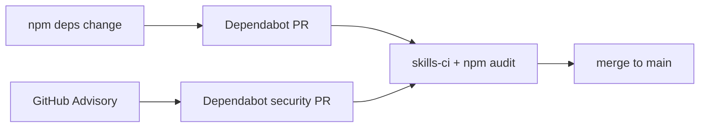

# Dependabot + npm-security baseline

## Scope (this pass)

- Install agent skills for guidance
- Wire **Dependabot** (free) + `**npm audit` CI\*\* into the kit
- Catalog skills in `[recommended-skills.json](recommended-skills.json)`

**Out of scope:** npm Trusted Publishing / OIDC publish workflow (next pass after this lands).

## Kit constraint

Per [AGENTS.md](AGENTS.md): do **not** commit third-party skill trees under `.agents/skills/` or `skills/`. Install with `-g` for local agent use; list in `recommended-skills.json` for adopters/maintainers.

## 1. Install skills (local agent)

```bash
npx skills add github/awesome-copilot@dependabot -g -y
npx skills add aradotso/security-skills@npm-security-best-practices -g -y
```

Then follow those skills while applying repo changes below.

## 2. Catalog in recommended-skills.json

Add two entries under `recommended` (or `optional` with `recommend-maintainers` if you prefer maintainer-only — **default: `recommended` with `lifecycle_roles: ["secure", "maintain"]`**):

| id                            | source                                        | install                                                                  |
| ----------------------------- | --------------------------------------------- | ------------------------------------------------------------------------ |
| `dependabot`                  | `github/awesome-copilot` / skill `dependabot` | `npx skills add github/awesome-copilot@dependabot -g`                    |
| `npm-security-best-practices` | `aradotso/security-skills`                    | `npx skills add aradotso/security-skills@npm-security-best-practices -g` |

Include trust notes: GitHub org (high trust); aradotso is smaller (783 installs) — review `SKILL.md` before team rollout. Refresh kit snapshot via `./scripts/prepare-create-adsk-snapshot.sh` so `[packages/create-adsk/kit-snapshot/recommended-skills.json](packages/create-adsk/kit-snapshot/recommended-skills.json)` matches.

## 3. Wire Dependabot

Add `[.github/dependabot.yml](.github/dependabot.yml)`:

```yaml
version: 2
updates:
  - package-ecosystem: npm
    directory: /
    schedule:
      interval: weekly
    open-pull-requests-limit: 10
    labels: [dependencies]
    groups:
      create-adsk-production:
        dependency-type: production
        patterns: ["*"]
      create-adsk-dev:
        dependency-type: development
        patterns: ["*"]

  - package-ecosystem: github-actions
    directory: /
    schedule:
      interval: weekly
    labels: [dependencies, github-actions]
```

Root lockfile already exists (`[package-lock.json](package-lock.json)` + workspace `[packages/create-adsk](packages/create-adsk)`).

**Manual (GitHub UI, once):** Security → enable Dependabot alerts + Dependabot security updates (free; not fully encoded in YAML).

## 4. npm audit in CI

Extend `[.github/workflows/skills-ci.yml](.github/workflows/skills-ci.yml)` (already runs on every PR/`main`) with:

1. `npm ci` (reproducible install)
2. `npm audit --audit-level=high` (fail on high/critical)

Keep existing Tier 1 skill gates. Use Node 22 to match current workflow. Prefer `npm ci` without committing aggressive `ignore-scripts=true` in a root `.npmrc` (that can break legitimate tooling); apply `--ignore-scripts` only in the audit/install CI step if installs stay green without lifecycle scripts.

Add matching verify line to `[.cursor/rules/project-cmds/RULE.md](.cursor/rules/project-cmds/RULE.md)`:

```bash
npm ci && npm audit --audit-level=high
```

## 5. Docs touch-up

- `[SECURITY.md](SECURITY.md)`: short “Dependency security” section pointing at Dependabot + `npm audit` in CI
- Skip README churn unless a one-line pointer is needed under release/security

## 6. Verify

```bash
npm ci
npm audit --audit-level=high
npm test -w create-adsk
./scripts/sync-adsk.sh self-check
./scripts/check-skills-ci.sh --self-test
```

## Flow after merge



Trusted Publishing / provenance for `create-adsk` remains a follow-up before public `npx create-adsk`.
