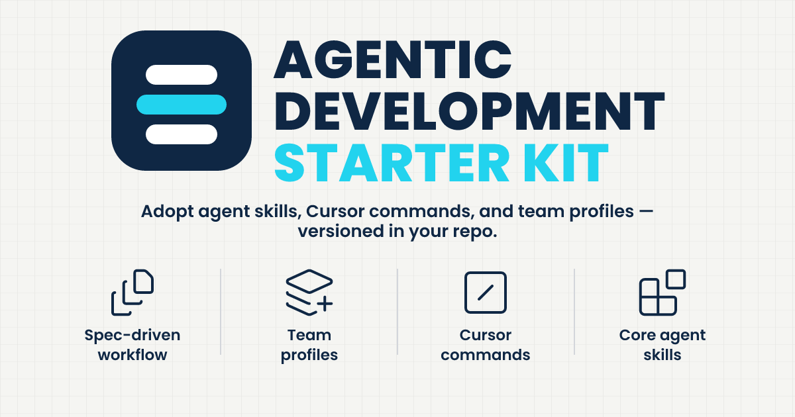

# The Agentic Development Starter Kit (ADSK)

[](LICENSE)
[](https://agentskills.io)
[](https://www.npmjs.com/package/create-adsk)
[](https://socket.dev/npm/package/create-adsk)

Adopt agent skills, Cursor commands, and team profiles — versioned in your repo.

**Repository:** [`rhyanvargas/agentic-development-starter-kit`](https://github.com/rhyanvargas/agentic-development-starter-kit)

## Quick Start

### Interactive

```bash
npx create-adsk
```

Follow the prompts to pick a profile (`core`, `delivery`, `maintainer`, or `skills-only`) and optionally add packs. That installs skills, optional Cursor commands, and `.adsk/config.json`. Team framing: [docs/product/for-eng-leads.md](docs/product/for-eng-leads.md).

### Non-interactive

```bash
npx create-adsk --profile delivery --yes
```

| Flag | Meaning |
|------|---------|
| `--profile <id>` | Choose a profile without prompting |
| `--yes` / `-y` | Skip prompts (`core` if `--profile` is omitted; packs off unless set below) |
| `--packs <ids>` | Comma-separated pack IDs (e.g. `engineering-methods`) |
| `--with-optional-packs` | Include all packs |

Later: `npx create-adsk update` · `npx create-adsk status` · [create-adsk docs](packages/create-adsk)

### Alternatives

| Goal | Command / path |
|------|----------------|
| Skills only (no Cursor / no profile config) | `npx skills add rhyanvargas/agentic-development-starter-kit` |
| Cursor sync without create-adsk | [docs/using-adsk.md](docs/using-adsk.md) (`sync-adsk.sh adopter`) |

Skills install under `.agents/skills/`. Full adopter guide: [docs/using-adsk.md](docs/using-adsk.md). Maintainers: [docs/upgrading.md](docs/upgrading.md#kit-maintainers).

### Two tools

| Tool | Use when |
|------|----------|
| **`npx create-adsk`** | You want a versioned ADSK **profile** (skills + Cursor + config) |
| **`npx skills`** | You only want skill folders |

Profiles: [`profiles.json`](profiles.json). Contract: [docs/product/create-adsk.md](docs/product/create-adsk.md).

## What’s in this kit repo

| Layer | Path | Purpose |
|-------|------|---------|
| **Package source** | `skills/<name>/` | What `npx skills add` publishes from |
| **Discovery (this repo)** | `.agents/skills/`, `.cursor/skills/` | Symlinks → `skills/` only (do not vendor upstream trees here) |
| **Cursor wiring** | `.cursor/commands/`, `.cursor/rules/` | Optional slash commands + quality gates |
| **Adopter CLI** | [`packages/create-adsk`](packages/create-adsk) | `npx create-adsk` — init / update / status |
| **Sync script** | [`scripts/sync-adsk.sh`](scripts/sync-adsk.sh) | Kit discovery links + adopter Cursor sync (`kit` / `adopter` / `self-check`) |
| **Brand assets** | [`assets/`](assets/) | Logo, favicons, social preview (`social-preview.svg` / `.png`) |
| **Recommended upstream** | [`recommended-skills.json`](recommended-skills.json) | Pinned external skills for **adopter apps** (not shipped as first-party) |

**Your app** should use `.agents/skills/` only — see [docs/using-adsk.md](docs/using-adsk.md).

## First-party skills

- **`spec-driven-workflow`** — spec → plan → implement → review (+ brownfield extract)
- **`devops-strategy-facilitator`** — concise CI/CD, branching, environments strategy
- **`release-automation`** — Conventional Commits → changelog/semver (GitHub or Azure DevOps; `/setup-releases`)
- **`skill-optimizer`** — author/optimize skills for trigger accuracy, clarity, and token cost
- **`readme-authoring`** — evidence-grounded README create/update/review (audience-aware; `/update-readme`)
- **`supply-chain-gate`** — Socket / supply-chain PR triage and dependency intake (`/setup-socket`)
- **`pull-request-authoring`** — open/refresh GitHub PRs from branch commits (`/create-pr`)

Source of truth for which profile installs which skills: [`profiles.json`](profiles.json).

## Recommended upstream (adopter apps)

Install after trust review — pins and commands in [`recommended-skills.json`](recommended-skills.json):

- **Recommended:** Superpowers (full tree), Vercel Labs `find-skills`, Dependabot guide, npm security best practices; Anthropic `skill-creator` (maintainers)
- **Optional packs (create-adsk):** `engineering-methods` ([docs](docs/engineering-methods.md)), `product-value-loop` ([docs](docs/product-value-loop.md)), plus `frontend-design`

## Product value loop (optional)

```text
Discover → Research → Prioritize → Plan → Execute → (measure) → Discover
```

Optional upstream skills for that loop install **project-local** or **global** (`-g`) via the `product-value-loop` pack — see **[docs/product-value-loop.md](docs/product-value-loop.md)**. They complement ADSK spec-driven delivery; they do not replace it.

## Try this repo in Cursor

```bash
git clone https://github.com/rhyanvargas/agentic-development-starter-kit.git
cd agentic-development-starter-kit
```

**Delivery path:** `/quick-start` → `/draft-spec` → `/plan-impl` → `/implement-spec` → `/review`.

**Product path (after installing the optional pack):** Discover/Research/Prioritize with the product skills → then the same ADSK delivery commands — see [docs/product-value-loop.md](docs/product-value-loop.md).

## Docs

**Adopters**

| Doc | Topic |
|-----|--------|
| [docs/using-adsk.md](docs/using-adsk.md) | Install, create-adsk, ask-agent sync, Cursor, custom skills |
| [docs/product/create-adsk.md](docs/product/create-adsk.md) | Product contract — create-adsk profiles |
| [docs/product/for-eng-leads.md](docs/product/for-eng-leads.md) | Eng-lead pitch — team standard vs skills.sh |
| [docs/product/profiles-and-packs.md](docs/product/profiles-and-packs.md) | Profile (depth) × pack (methodology) model |
| [packages/create-adsk](packages/create-adsk) | `create-adsk` CLI (init / update / status) |
| [`profiles.json`](profiles.json) | Machine-readable adopter profiles |
| [docs/product-value-loop.md](docs/product-value-loop.md) | Optional pack: discover → research → prioritize → plan → execute |
| [docs/engineering-methods.md](docs/engineering-methods.md) | Optional pack: TDD / debug / writing-plans wired into SDD |
| [docs/upgrading.md](docs/upgrading.md) | Updates (adopter section) |

**Kit maintainers**

| Doc | Topic |
|-----|--------|
| [AGENTS.md](AGENTS.md) | Repo layout contract (package source vs discovery) |
| [CONTRIBUTING.md](CONTRIBUTING.md) | Contributions; do not vendor upstream skills |
| [`scripts/sync-adsk.sh`](scripts/sync-adsk.sh) | `kit` / `self-check` after first-party skill changes |
| [docs/upgrading.md](docs/upgrading.md#kit-maintainers) | Sync / upgrade playbook |
| [docs/skill-authoring.md](docs/skill-authoring.md) / [evaluating-skills.md](docs/evaluating-skills.md) | Author + eval skills |
| [docs/lifecycle-coverage.md](docs/lifecycle-coverage.md) / [docs/evals/SCORECARD.md](docs/evals/SCORECARD.md) | Coverage map |
| [docs/RELEASE.md](docs/RELEASE.md) / [CHANGELOG.md](CHANGELOG.md) | Kit release-please **and** optional npm `create-adsk` publish |

## Contributing

See [CONTRIBUTING.md](CONTRIBUTING.md). Security reports: [SECURITY.md](SECURITY.md). Code of conduct: [CODE_OF_CONDUCT.md](CODE_OF_CONDUCT.md).

## License

Apache License 2.0 — see [LICENSE](LICENSE) and [NOTICE](NOTICE).
