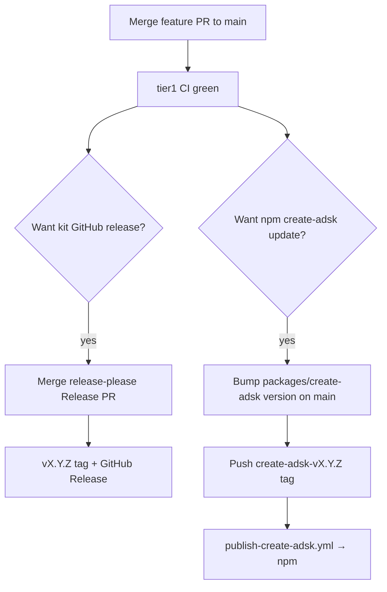

# Releases — ADSK

Two release tracks share `main` but are **independent**:

| Track | What ships | Trigger | Version source |
|-------|------------|---------|----------------|
| **Kit** (GitHub) | Skills, Cursor wiring, docs, scripts | Merge release-please PR → `vX.Y.Z` tag | `version.txt` / `.release-please-manifest.json` |
| **npm** (`create-adsk`) | CLI package adopters run via `npx create-adsk` | Push `create-adsk-vX.Y.Z` tag | `packages/create-adsk/package.json` `version` |

Merging to `main` does **not** publish to npm. Publishing to npm does **not** cut a kit GitHub release.



## Day-to-day: push kit updates

1. Open a PR → approve workflows if prompted → wait for required **`tier1`** → merge (no bypass).
2. Use Conventional Commit **PR titles** (`feat:`, `fix:`, `docs:`, …). User-visible skill/adopter changes should be `feat` / `fix` so they appear in the kit changelog.
3. release-please opens/updates a **Release PR** (e.g. `chore(main): release 0.5.1`) that bumps `CHANGELOG.md` + `version.txt`.
4. When you want a kit GitHub release, merge that Release PR → creates `vX.Y.Z` + GitHub Release.

Most commits stop after step 1–2. Steps 3–4 are optional timing (batch several features into one kit release).

| Artifact | Role |
|----------|------|
| `.github/workflows/release-please.yml` | Runs on push to `main` |
| `release-please-config.json` | `simple` release type → `CHANGELOG.md` + `version.txt` |
| `.release-please-manifest.json` | Last released kit version |
| `version.txt` | Kit semver |
| `CHANGELOG.md` | Kit changelog |

## Optional: publish / update `create-adsk` on npm

Do this when adopters should get a new CLI via `npx create-adsk` (CLI code, vendored `kit-snapshot`, or package metadata changed). Skills-only kit changes that adopters pull via `npx skills` / `create-adsk update` from git do **not** require an npm bump unless the snapshot/CLI should change.

### First time only (bootstrap)

Already done if `create-adsk@0.0.0` exists and Trusted Publisher points at `publish-create-adsk.yml`. Details: [`.cursor/plans/create_adsk_npm_first_publish.plan.md`](../.cursor/plans/create_adsk_npm_first_publish.plan.md).

1. Placeholder on registry + Trusted Publisher (`rhyanvargas` / `agentic-development-starter-kit` / `publish-create-adsk.yml`)
2. Prefer disallowing long-lived publish tokens after OIDC works — [SECURITY.md](../SECURITY.md)

### Later npm releases

1. Land CLI/snapshot changes on `main` (PR + green `tier1`).
2. Bump `packages/create-adsk/package.json` `version` on `main` (same PR or follow-up).
3. From a clean `main` checkout matching that version:

```bash
./scripts/tag-create-adsk-release.sh --push
# or: git tag -a create-adsk-vX.Y.Z -m "create-adsk vX.Y.Z" && git push origin create-adsk-vX.Y.Z
```

4. Watch **Actions → publish-create-adsk** (OIDC; no `NPM_TOKEN`).
5. Verify: `./scripts/verify-create-adsk-registry.sh --npx`

| Artifact | Role |
|----------|------|
| [`.github/workflows/publish-create-adsk.yml`](../.github/workflows/publish-create-adsk.yml) | Publish on `create-adsk-v*` tags |
| Tag pattern | `create-adsk-vX.Y.Z` must match `package.json` version |

Optional pack dry-run (no publish): `gh workflow run publish-create-adsk.yml -f dry_run=true`

## Decision guide

| Change | Kit release PR? | npm tag? |
|--------|-----------------|----------|
| Skill / Cursor / docs only | When you want a GitHub release note | Usually **no** |
| `packages/create-adsk` CLI or `kit-snapshot` | Optional (same PR can be `feat`) | **Yes**, after version bump |
| CI / maintainer scripts only | Optional | **No** |

## Bootstrap — first kit public tag (v0.1.0)

Do this **once** before relying on release-please for later kit versions. Manifest and `version.txt` already say `0.1.0` historically; later versions come from merging Release PRs only.

- [ ] Repository / remotes / README URLs correct
- [ ] `./scripts/sync-adsk.sh self-check` and `./scripts/check-skills-ci.sh --self-test` pass
- [ ] Branch protection requires **`tier1`**; do **not** require `skills-evals-soft`

## Permissions note

release-please uses `GITHUB_TOKEN` with `contents` + `pull-requests` write. If Release PRs fail to open, allow Actions to create PRs or use a PAT per [release-please-action credentials](https://github.com/googleapis/release-please-action#github-credentials).

## Optional next

- Publish/list on [skills.sh](https://skills.sh) via `npx skills`
- Tier 2 evals — [docs/evaluating-skills.md](evaluating-skills.md)
- Enterprise adoption docs if targeting large orgs
