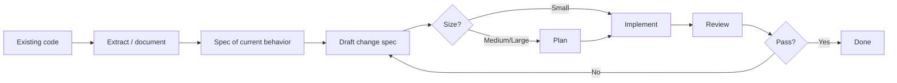

# Brownfield Workflow

Work with existing codebases using the spec-driven approach: document reality first, then change safely.

## Overview



## When to use

- Large or poorly documented modules
- Refactors that change behavior or boundaries
- Onboarding onto a legacy area
- Before multi-file changes where intent is unclear

Skip formal extract for tiny, obvious fixes (typos, one-line clear bugs).

## Step-by-step

### 1. Orient

Scan the area you will change:

- Entry points, public APIs, data models
- Existing tests and how they run
- Conventions in neighboring code

### 2. Extract a baseline spec

Document **current** behavior (not the desired future):

```
/extract-spec path/or/feature-description
```

Or, without Cursor: explore the code and write a spec under the project's specs directory describing what the system does today.

**Output:** a baseline spec at the resolved spec home (Cursor default `.cursor/docs/specs/{area}-current.md`; portable `docs/specs/{area}-current.md`)

Include:

- Overview of responsibility
- Observed requirements / behaviors (`REQ-XXX` where useful)
- Known edge cases and debt
- Out of scope (what you did not inspect)
- Test gaps (what is untested today)

### 3. Draft the change spec

Write a **delta** spec for the desired change:

```
/draft-spec "Change X so that Y, given baseline in specs/{area}-current.md"
```

Link the baseline. Call out migrations, compatibility, and rollback concerns.

### 4. Plan (medium/large)

```
/plan-impl path/to/change-spec.md
```

Call out risk areas: shared modules, data migrations, API consumers.

### 5. Implement and verify

```
/implement-spec path/to/change-spec.md
```

- Prefer extending existing tests before changing behavior
- **Fail-closed verify:** run `project-cmds` / project verify after each meaningful slice; if verify is missing, refuse “done” and point to `/quick-start`
- Keep the baseline spec updated if you discover prior behavior was wrong

### 6. Review

```
/review --spec path/to/change-spec.md
```

Check regressions, compatibility, and that undocumented behavior was not silently dropped.

## Tips

- Prefer the highest useful seam (API/module boundary) when documenting.
- Do not invent requirements; mark unknowns as open questions.
- For very large systems, extract one bounded context at a time.
- Pair with recommended upstream skills (TDD, systematic debugging) when implementing under uncertainty — see repo `recommended-skills.json`.

## Related

- [Greenfield Workflow](greenfield-workflow.md)
- [Spec Writing Guide](spec-writing-guide.md)
- [Commands Reference](commands-reference.md)
